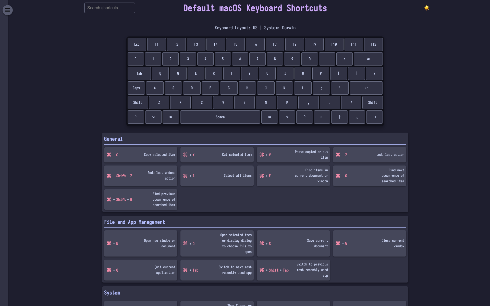

<p align="center">
  
</p>

# KoalaKeys

A simple tool to create and manage portable keyboard shortcut cheat sheets.

> **Demo**: Check out the [live demo](https://rtuszik.github.io/KoalaKeys-Collection/) to see a small collection of cheat sheets created with this project.

## Overview

KoalaKeys generates and organizes portable, interactive HTML cheat sheets for keyboard shortcuts. It's designed for developers, designers, and power users who want to keep their essential shortcuts easily accessible.

> **Quick Start**: Run `uvx koalakeys init` to scaffold a project, add or edit YAML files in its `cheatsheets/` directory, then run `koalakeys generate`. For detailed YAML formatting instructions, see the [YAML Cheat Sheet Specification Guide](yaml_cheatsheet_spec.md).

## Screenshots

<p align="center">
  
    </a>
</p>

## Features

- Generate HTML cheat sheets from YAML files
- Interactive keyboard layout with real-time highlighting
- Six built-in themes (catppuccin, dracula, gruvbox, nord, rosé-pine, solarized) plus user themes and custom CSS
- Categorized shortcuts with descriptions
- Index page for quick access to all cheat sheets
- Search functionality
- Support for different keyboard layouts and system mappings

## Demo and Examples

A live demo instance is available, showcasing a selection of cheat sheets:

- **Demo Site**: [https://rtuszik.github.io/KoalaKeys-Collection/](https://rtuszik.github.io/KoalaKeys-Collection/)
- **Demo Repository**: [https://github.com/rtuszik/KoalaKeys-Collection](https://github.com/rtuszik/KoalaKeys-Collection)

Explore the demo to see how KoalaKeys works and to get ideas for creating custom cheat sheets. The demo repository also contains example YAML files that can be used as templates for new cheat sheets.

## Available Systems and Keyboards

### Systems

- Darwin (macOS)
- Linux
- Windows

### Keyboard Layouts

- US
- UK
- DE (German)
- FR (French)
- ES (Spanish)
- DVORAK

## Requirements

- Python 3.9+
- [uv](https://docs.astral.sh/uv/)

## Installation

### Recommended: run as a tool (no clone)

Run KoalaKeys directly with [uv](https://docs.astral.sh/uv/), no need to clone the repository:

```
uvx koalakeys init        # scaffold ./koalakeys/cheatsheets/ with an example sheet
```

Or install it on your PATH:

```
uv tool install koalakeys     # or: pipx install koalakeys
```

### From source (for development)

1. Clone the repository and install dependencies:

    ```
    git clone https://github.com/rtuszik/KoalaKeys
    cd KoalaKeys
    uv sync --locked
    ```

2. Run via `uv run koalakeys ...`.

## Usage

KoalaKeys is a multi-command CLI. All commands operate on the **current directory**: they read `cheatsheets/` and write to `output/` (or `CHEATSHEET_OUTPUT_DIR` if set).

| Command                     | What it does                                                                                                                                                            |
| --------------------------- | ----------------------------------------------------------------------------------------------------------------------------------------------------------------------- |
| `koalakeys init [path]`     | Scaffold a new project directory with an example cheat sheet. Defaults to `./koalakeys`; use `.` for the current directory. Pass `--force` to overwrite existing files. |
| `koalakeys generate`        | Generate HTML for every YAML file in `cheatsheets/`, plus an index page.                                                                                                |
| `koalakeys validate [file]` | Validate cheat sheet YAML. Checks all of `cheatsheets/` by default, or a single file. Exits non-zero on failure (CI-friendly).                                          |

Typical first run:

```
koalakeys init
cd koalakeys
koalakeys generate
```

Then open `output/index.html` to view the cheat sheet collection. For detailed YAML formatting, see the [YAML Cheat Sheet Specification Guide](yaml_cheatsheet_spec.md).

### Output directory (optional)

By default cheat sheets are written to `output/` in the current directory. To change this, set `CHEATSHEET_OUTPUT_DIR` (e.g. in a `.env` file):

```
CHEATSHEET_OUTPUT_DIR=path/to/your/output/directory
```

## Theming

Set a theme per cheat sheet with a single key:

```yaml
theme: dracula
```

See the [YAML Cheat Sheet Specification Guide](yaml_cheatsheet_spec.md) for the built-in themes, user-theme authoring, and custom CSS.

## Schema

Validate your YAML with the published JSON Schema:

- Public URL: https://rtuszik.github.io/KoalaKeys/schema/cheatsheet.schema.json
- Per-file modeline (first line in each YAML):

    ```
    # yaml-language-server: $schema=https://rtuszik.github.io/KoalaKeys/schema/cheatsheet.schema.json
    ```

- Neovim yamlls mapping (optional):

    ```lua
    require('lspconfig').yamlls.setup({
      settings = {
        yaml = {
          schemas = {
            ["https://rtuszik.github.io/KoalaKeys/schema/cheatsheet.schema.json"] = "cheatsheets/*.yaml",
          },
        },
      },
    })
    ```

## Contributing

Contributions are welcome! Feel free to submit issues, feature requests, or pull requests.

## License

This project is licensed under the terms of the [GPLv3](LICENSE).
